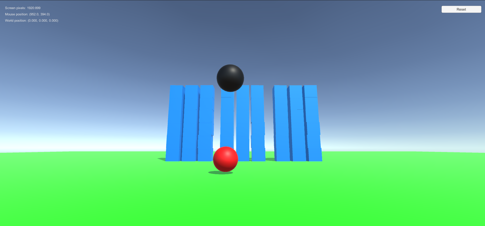
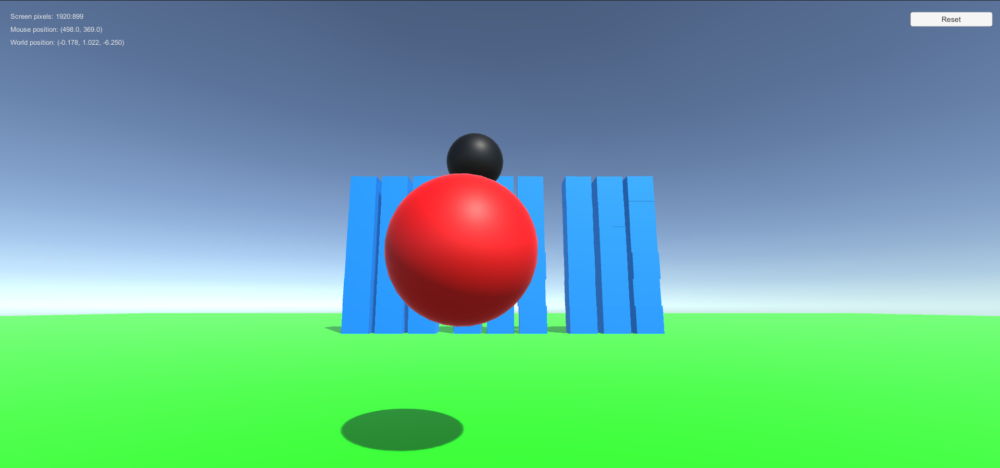
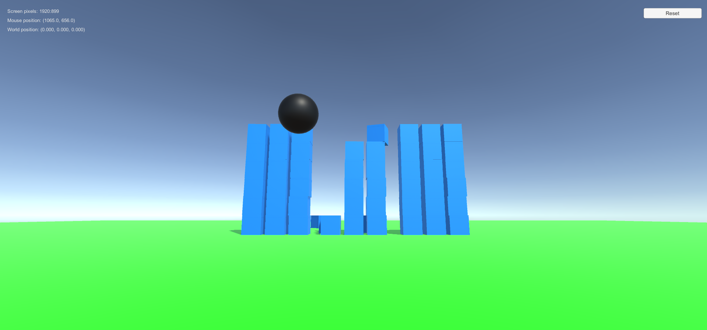

# AngryBirds3D

<b>Work Description</b>

Using 'joint' functionality, create a physical slingshot, where the goal of the game is to fire a ball using a mouse. The fired projectile must fly towards a castle (cubes). The game is a minimalistic 'Angry Birds' clone.

This game was made for Introduction to Game Development Lecture final exam <b>in just 30 minutes and using only default 3D objects</b> included in Unity.

<b>Screenshots:</b>

